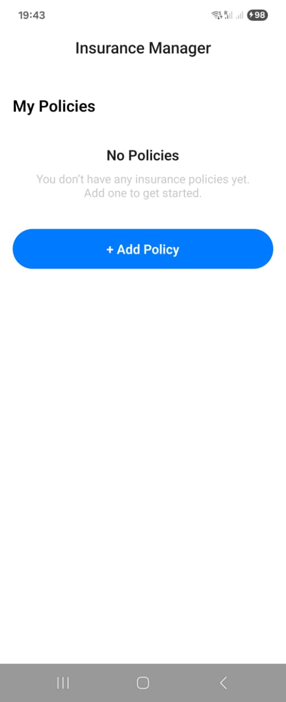
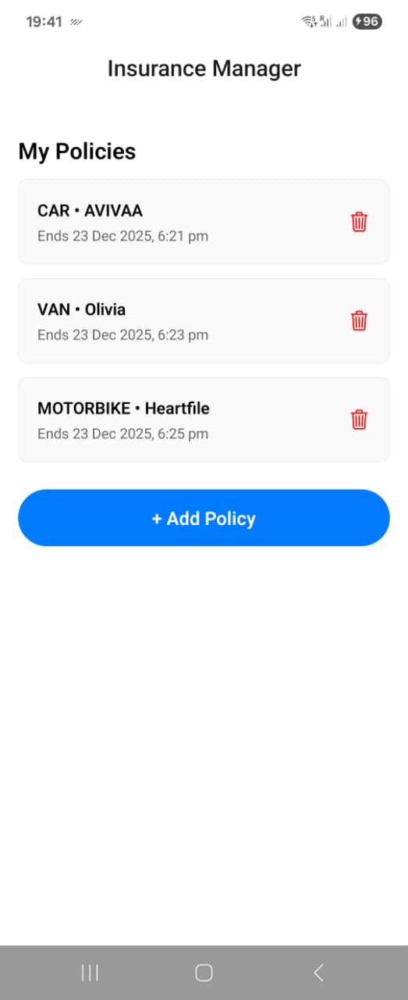
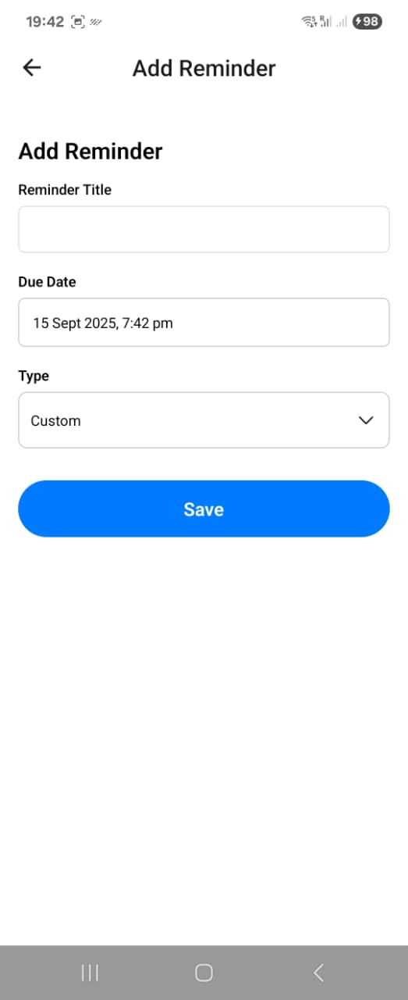

# 📱 Insurance Manager App

A React Native + Expo application for managing insurance policies, documents, and reminders.  
Built with **Expo Router**, **Redux Toolkit**, and **Clean Architecture principles**.  

This project was implemented as part of the **Insurance App Technical Challenge**.

---

## 🚀 Features

### Core
- **Policy Management**  
  - Add, edit, delete insurance policies  
  - Supported types: `car`, `van`, `motorbike`, `house`  
  - Dashboard with upcoming renewals  

- **Documents**  
  - Attach documents to a policy (from camera or library)  
  - Stored offline using Expo File System  
  - Supported previews: `jpg`, `jpeg`, `png`, `txt`  
  - Open `pdf`, `doc`, `docx` in external viewer  
  - Download/save locally  

- **Reminders & Notifications**  
  - Renewal, payment, or custom reminders  
  - Scheduled as local notifications via Expo Notifications  
  - Cancelled when deleted  

### Technical
- **Offline-first**  
  - Mutations (`create`, `update`, `delete`) are queued when offline  
  - Background sync automatically flushes when network returns  
  - Manual **Sync now** button available  

- **State Management**  
  - Redux Toolkit + `createEntityAdapter`  
  - Normalized slices for `policies`, `documents`, `reminders`, `offlineQueue`  
  - Persistent storage via `redux-persist` + AsyncStorage  

- **Architecture**  
  - **Domain layer**: Entities + Use-cases  
  - **Data layer**: API client, repositories, DTO mappers  
  - **Store layer**: Redux slices + middleware  
  - **UI layer**: Reusable components + feedback views (Loading/Error)  

- **Testing**  
  - Jest + React Native Testing Library  
  - Unit tests: reducers, API, notifications, offline queue  
  - Integration tests: Add policy, add document, add reminder, edit policy  
  - Coverage reporting via `jest --coverage`  

---

## 🏗️ Project Structure

apps/insurance/
├─ app/ # Expo Router screens
│ ├─ index.tsx # Dashboard
│ ├─ policy/ # Policy-related screens
│ │ ├─ new.tsx
│ │ ├─ [id].tsx
│ │ ├─ [id]/editPolicy.tsx
│ │ ├─ [id]/deletePolicy.tsx
│ │ ├─ [id]/addDocument.tsx
│ │ ├─ [id]/addReminder.tsx
│ └─ document/[documentId].tsx
│
├─ src/
│ ├─ domain/ # Entities + Use-cases
│ ├─ data/ # API client, repositories, mappers
│ ├─ store/ # Redux slices + offline sync middleware
│ ├─ services/ # Notifications, file storage, image picker
│ ├─ ui/ # Design system + reusable UI components
│ └─ utils/ # Helpers (dates, Result<T,E>)
│
├─ tests/ # Jest + RNTL tests
│
├─ app.json
├─ package.json
├─ jest.config.js
├─ tsconfig.json
└─ README.md

## ⚙️ Installation & Setup

1. **Clone the repo**
   ```bash
   git clone https://github.com/your-org/insurance-app.git
   cd insurance-app/apps/insurance

   npm install

   npm run start or npx expo start 

   npx expo run:android

   npx expo run:ios

   npm run test
   
   npm run test -- --coverage

Tests include:
policiesSlice.test.ts → policies reducer
addPolicyFlow.test.tsx → UI flow for creating a policy
addDocumentFlow.test.tsx → document upload
addReminderFlow.test.tsx → reminders scheduling
editPolicyFlow.test.tsx → policy editing
notifications.test.ts → local notifications
offlineSync.test.ts → enqueue/dequeue jobs
policyRepository.test.ts → API + DTO mapping
offlineEnqueue.test.ts → createPolicy use-case enqueues when offline

Offline & Sync Flow
If online:
Actions call API via RemotePolicyRepository.
If offline:
Mutations are enqueued in offlineQueueSlice.
Local state updated optimistically.
Background middleware (offlineSync.ts) flushes the queue when network is back.

Technologies:
React Native
Expo
Expo Router
Redux Toolkit + redux-persist
expo-notifications
expo-file-system
expo-image-picker
Jest + React Native Testing Library

## 📷 Screenshots

### Dashboard




### Add Policy


### Add Document


### Document Viewer


### Reminders
